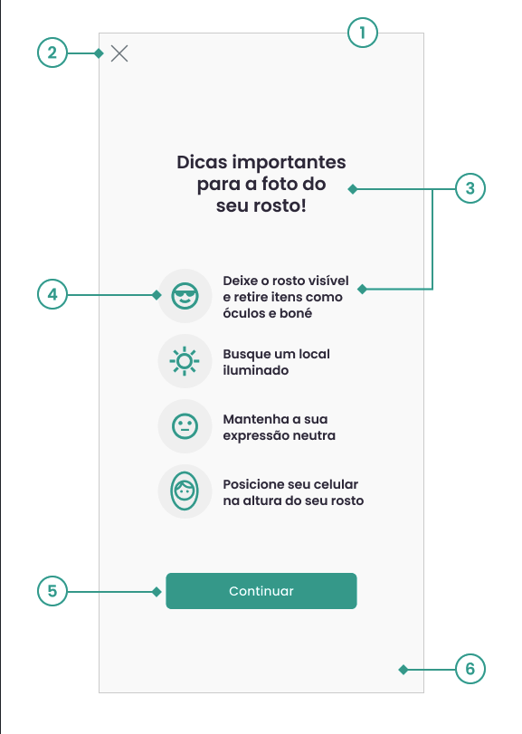
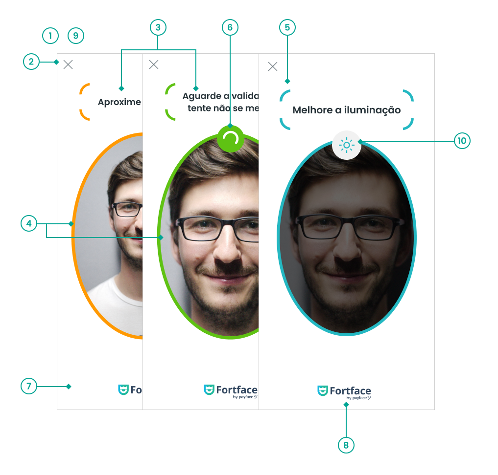
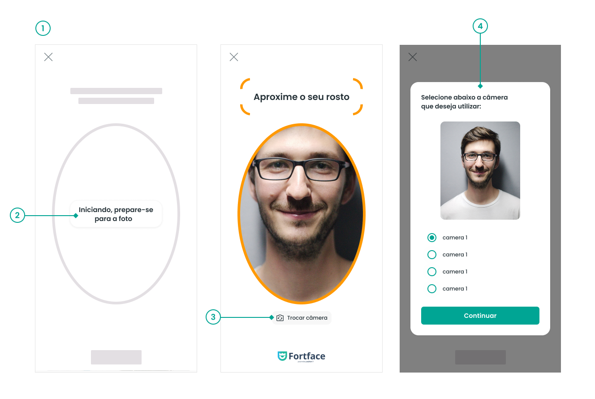

# Este documento trata com detalhes a implementação do componente da Fortface no exemplo em Angular relacionado ao Liveness 3D.

## 1 - Login e inserção de dados

Ao abrir o endereço https://localhost:4200 no seu navegador web, você cairá na tela de login
<br>
Utilize um operador cadastrado em nosso sistema para acessar a tela de inserção de dados
<br>
Informe seu CPF, nome e data de nascimento.
<br>
Você terá os seguintes itens no menu:

- [Liveness 2D](https://github.com/oititec/liveness-angular-example/blob/main/src/app/liveness2d/README.md)
- [Liveness 3D](https://github.com/oititec/liveness-angular-example/blob/main/src/app/liveness3d/README.md)
- [Liveness 3D Facetec v10](https://github.com/oititec/liveness-angular-example/blob/main/src/app/facetec-v10/README.md)
- [Liveness 3D Iproov](https://github.com/oititec/liveness-angular-example/blob/main/src/app/iproov/README.md)
- [Liveness 3D Fortface](https://github.com/oititec/liveness-angular-example/blob/main/src/app/fortface/README.md)
- [Envio de documentos](https://github.com/oititec/liveness-angular-example/blob/main/src/app/senddocument/README.md) - Este último só estará disponível ao finalizar um do processos de Liveness

## 2 - Liveness 3D Fortface

O **Liveness 3D Fortface** é disponibilizado como um **WebComponent**, carregado via script no arquivo `index.html`, não sendo necessária a instalação de bibliotecas NPM.

Durante a inicialização da aplicação são executadas as etapas de autenticação e preparação da sessão. A validação de liveness é iniciada somente quando o usuário aciona o botão **"Iniciar Validação Fortface"**.

---

## Fluxo da Aplicação

```text
FortfaceSDK.load()
        │
        ▼
createFreshSdk()
        │
        ▼
createSession()
        │
        ▼
createFortfaceSession()
        │
        ▼
Aplicação pronta
        │
        ▼
Usuário inicia validação
        │
        ▼
Fortface.startSession()
        │
        ▼
Captura da prova de vida
        │
        ▼
fortfaceFinishSession()
        │
        ▼
handleResult()
        │
        ▼
verifyFortfaceLiveness()
        │
        ▼
Resultado
```

---

## Métodos do WebComponent Fortface

| Método | Descrição |
| ------- | --------- |
| `load()` | Realiza o carregamento do SDK. |
| `start()` | Inicializa o componente e retorna o `deviceRequestInfo`. |
| `setCustomizer()` | Insere a customização  no componente. |
| `startSession()` | Inicia a captura da prova de vida. |

---

## Métodos da implementação Angular

| Método | Descrição |
| ------- | --------- |
| `createFreshSdk()` | Remove qualquer instância anterior do WebComponent, cria uma nova instância e obtém o `deviceRequestInfo`. |
| `createSession()` | Inicializa a sessão do usuário. |
| `startLivenessValidation()` | Inicia a captura da prova de vida. |
| `fortfaceFinishSession()` | Recebe os eventos retornados pelo SDK (captura, cancelamento, timeout ou erro). |
| `handleResult()` | Envia os dados capturados para validação e trata o resultado retornado pela API. |
| `updateStatus()` | Atualiza a mensagem de status exibida na interface. |

---

## Estrutura da Interface

A tela possui uma implementação simples composta por:

- Botão para iniciar a validação.
- Área de exibição do status da operação.
- Container onde o WebComponent `fortface-sdk` é inserido dinamicamente.
- Logo da Fortface.

O componente é criado dinamicamente através do método `createFreshSdk()`

---

## Fluxo dos Serviços

O serviço `FacecaptchasService` encapsula toda a comunicação com a API.

| Método | Endpoint | Objetivo |
| ------- | -------- | -------- |
| `createFortfaceSession()` | `/facecaptcha/service/captcha/fortface/session-token` | Envio da appkey, userAgent e deviceRequestInfo para abertura da sessão Fortface|
| `verifyFortfaceLiveness()` | `/facecaptcha/service/captcha/fortface/liveness` | Envio dos dos dados da sessão gerados pelo SDK para validação da captura. |

---

## Sequência da Validação

1. Carrega o SDK Fortface.
2. Cria uma instância do WebComponent.
4. Cria a sessão
3. Aguarda a ação do usuário.
4. Inicializa a captura.
5. Executa a prova de vida.
6. Envia os dados para validação.
7. Exibe o resultado..

---

## Observações

- O SDK da Fortface **bloqueia** a chamada para validação do liveness se a **guia de desenvolvedor (F12)** do navegador estiver aberta

## Customizações

Com objetivo de deixar a experiência de captura mais próxima da sua identidade visual, é possível realizar customizações de alguns componentes no layout da tela de Instrução e Câmera.

## Como utilizar

As customizações são aplicadas por meio do método `setCustomizer()` do componente `fortface-sdk`.

> **Importante:** o método `setCustomizer()` deve ser chamado **após** a inicialização do SDK com `start()` e **antes** da chamada de `startSession()`.

### Tema

#### `FortfaceCustomizer.theme.appearance`

| Propriedade | Tipo | Padrão | Descrição |
|---|---|---|---|
| `font_family` | `string` | `Helvetica` | Família da fonte utilizada |
| `background_color` | `string` | `#FFFFFF` | Cor de fundo |
| `logo` | `string` | — | Logo utilizada |
| `orientation` | `automatic` \| `portrait` \| `landscape` | `automatic` | Orientação da interface |
| `modal.enabled` | `boolean` | `False` | Habilita ou desabilita o modal |
| `modal.overlayColor` | `string` | `#000000` | Cor da sobreposição do modal |
| `modal.overlayOpacity` | `number` | `0.4` | Opacidade da sobreposição |
| `modal.minScreenWidth` | `number` | `1024` | Largura mínima da tela para exibição do modal |


### Componentes padrões

#### `FortfaceCustomizer.theme.appearance.components.button`

| Propriedade | Tipo | Padrão | Descrição |
|---|---|---|---|
| `content` | `string` | — | Conteúdo exibido no botão |
| `background_color` | `string` | `#00A594` | Cor de fundo do botão |
| `text_color` | `string` | `#FFFFFF` | Cor do texto do botão |
| `pressed_background_color` | `string` | `#008577` | Cor de fundo do botão quando pressionado |
| `corner_radius` | `number` | `6` | Raio dos cantos do botão |
| `font.size` | `number` | — | Tamanho da fonte |
| `font.weight` | `number` | — | Peso da fonte. Valores permitidos: `100` a `900` |

#### `FortfaceCustomizer.theme.appearance.components.close_button`

| Propriedade | Tipo | Padrão | Descrição |
|---|---|---|---|
| `icon` | `string` | — | Ícone utilizado no botão fechar |
| `visible` | `boolean` | `True` | Define se o botão fechar será exibido |
| `position` | `top-left` \| `top-right` | `top-left` | Posição do botão fechar |

#### `FortfaceCustomizer.theme.appearance.components.title`

| Propriedade | Tipo | Padrão | Descrição |
|---|---|---|---|
| `content` | `string` | — | Conteúdo exibido no título |
| `color` | `string` | `#332D41` | Cor do título |
| `font.size` | `number` | — | Tamanho da fonte |
| `font.weight` | `number` | — | Peso da fonte. Valores permitidos: `100` a `900` |

#### `FortfaceCustomizer.theme.appearance.components.description`

| Propriedade | Tipo | Padrão | Descrição |
|---|---|---|---|
| `content` | `string` | — | Conteúdo exibido na descrição |
| `color` | `string` | `#332D41` | Cor da descrição |
| `font.size` | `number` | — | Tamanho da fonte |
| `font.weight` | `number` | — | Peso da fonte. Valores permitidos: `100` a `900` |

### Tela de instruções



## Tela de instruções

#### `FortfaceSDKCustomizer.face_recognition.instructions_screen`

### 1- Tela

| Propriedade | Tipo | Padrão | Descrição |
|---|---|---|---|
| `visible` | `boolean` | `True` | Define se a tela de instruções será exibida |

### 2- Botão Fechar/Voltar (X)

| Propriedade | Tipo | Padrão | Descrição |
|---|---|---|---|
| `close_button.icon` | `string` | — | Imagem do ícone do botão voltar/fechar |
| `close_button.visible` | `boolean` | `True` | Define se o botão voltar/fechar será exibido |

### 3- Textos

#### Fonte

| Propriedade | Tipo | Padrão | Descrição |
|---|---|---|---|
| `IFortfaceInstructions.font` | `string` | `Poppins, sans-serif` | Fonte utilizada nos textos da tela de instruções |

#### Cores

| Propriedade | Tipo | Padrão | Descrição |
|---|---|---|---|
| `title.color` | `string` | `#332D41` | Cor do título |
| `topics.messages.no_items.color` | `string` | `#332D41` | Cor do texto da instrução sobre itens no rosto |
| `topics.messages.well_lit.color` | `string` | `#332D41` | Cor do texto da instrução sobre iluminação |
| `topics.messages.neutral_expression.color` | `string` | `#332D41` | Cor do texto da instrução sobre expressão facial |
| `topics.messages.straight_position.color` | `string` | `#332D41` | Cor do texto da instrução sobre posicionamento |

#### Conteúdo

| Propriedade | Tipo | Padrão | Descrição |
|---|---|---|---|
| `topics.messages.no_items.content` | `string` | `Dicas importantes para a foto do seu rosto!` | Texto da instrução sobre itens no rosto |
| `topics.messages.well_lit.content` | `string` | `Busque um local iluminado` | Texto da instrução sobre iluminação |
| `topics.messages.neutral_expression.content` | `string` | `Mantenha a sua expressão neutra` | Texto da instrução sobre expressão facial |
| `topics.messages.straight_position.content` | `string` | `Posicione seu celular na altura do seu rosto` | Texto da instrução sobre posicionamento |

### 4- Ícones

| Propriedade | Tipo | Padrão | Descrição |
|---|---|---|---|
| `topics.icons.color` | `string` | `#00A594` | Cor dos ícones |
| `topics.icons.background_color` | `string` | `#F1F1F1` | Cor de fundo dos ícones |

### 5- Botão Continuar

| Propriedade | Tipo | Padrão | Descrição |
|---|---|---|---|
| `continue_button.background_color` | `string` | `#00A594` | Cor de fundo do botão |
| `continue_button.pressed_background_color` | `string` | `#008577` | Cor de fundo do botão quando pressionado |
| `continue_button.text_color` | `string` | `#FFFFFF` | Cor do texto do botão |
| `continue_button.content` | `string` | `Continuar` | Texto exibido no botão |
| `continue_button.corner_radius` | `string` | `6px` | Raio das bordas do botão |

### 6- Fundo da tela

| Propriedade | Tipo | Padrão | Descrição |
|---|---|---|---|
| `background_color` | `string` | `#FFFFFF` | Cor de fundo da tela de instruções |


## Tela de captura biométrica



#### `FortfaceSDKCustomizer.face_recognition.camera_screen`

### 1- Timeout

| Propriedade | Tipo | Padrão | Descrição |
|---|---|---|---|
| `timeout` | `number` | `30` | Tempo limite para a captura biométrica |
| `brightness_validation.timeout` | `number` | `10` | Tempo limite para a validação da luminosidade |

### 2- Botão Fechar/Voltar (X)

| Propriedade | Tipo | Padrão | Descrição |
|---|---|---|---|
| `close_button.icon` | `string` | — | Imagem do ícone do botão voltar/fechar |
| `close_button.visible` | `boolean` | `True` | Define se o botão voltar/fechar será exibido |

### 3- Mensagens de feedback

#### Fonte

| Propriedade | Tipo | Padrão | Descrição |
|---|---|---|---|
| `IFortfaceCamera.font` | `string` | `Poppins, sans-serif` | Fonte utilizada nas mensagens da câmera |

#### Conteúdo

| Propriedade | Tipo | Padrão | Descrição |
|---|---|---|---|
| `positioning_messages.content.positioned` | `string` | `Aguarde a validação,\ntente não se mexer` | Mensagem exibida quando o rosto está corretamente posicionado |
| `positioning_messages.content.no_face` | `string` | `Posicione seu rosto na área indicada` | Mensagem exibida quando nenhum rosto é detectado |
| `positioning_messages.content.face_far` | `string` | `Aproxime o seu rosto` | Mensagem exibida quando o rosto está muito distante |
| `positioning_messages.content.face_near` | `string` | `Afaste o seu rosto` | Mensagem exibida quando o rosto está muito próximo |
| `positioning_messages.content.face_pitch_up` | `string` | `Abaixe seu rosto` | Mensagem exibida quando é necessário abaixar o rosto |
| `positioning_messages.content.face_pitch_down` | `string` | `Levante seu rosto` | Mensagem exibida quando é necessário levantar o rosto |
| `positioning_messages.content.no_face_yaw` | `string` | `Olhe para frente` | Mensagem exibida quando é necessário olhar para frente |
| `positioning_messages.content.face_roll_left` | `string` | `Incline sua cabeça para a esquerda` | Mensagem exibida quando é necessário inclinar a cabeça para a esquerda |
| `positioning_messages.content.face_roll_right` | `string` | `Incline sua cabeça para a direita` | Mensagem exibida quando é necessário inclinar a cabeça para a direita |
| `positioning_messages.content.face_center_left` | `string` | `Mova a câmera para a esquerda` | Mensagem exibida quando é necessário mover a câmera para a esquerda |
| `positioning_messages.content.face_center_right` | `string` | `Mova a câmera para a direita` | Mensagem exibida quando é necessário mover a câmera para a direita |
| `positioning_messages.content.face_center_up` | `string` | `Mova a câmera para cima` | Mensagem exibida quando é necessário mover a câmera para cima |
| `positioning_messages.content.face_center_down` | `string` | `Mova a câmera para baixo` | Mensagem exibida quando é necessário mover a câmera para baixo |
| `brightness_validation.brightnessEvaluation.messages.too_dark` | `string` | `Melhore a iluminação` | Mensagem exibida quando o ambiente está muito escuro |
| `brightness_validation.brightnessEvaluation.messages.too_bright` | `string` | `Diminua a luz no\nseu rosto` | Mensagem exibida quando o ambiente está muito claro |

#### Cor

| Propriedade | Tipo | Padrão | Descrição |
|---|---|---|---|
| `positioning_messages.color` | `string` | `#332D41` | Cor das mensagens de posicionamento |

### 4- Status

| Propriedade | Tipo | Padrão | Descrição |
|---|---|---|---|
| `feedback_colors.alert` | `string` | `#FF9902` | Cor utilizada para indicar um alerta |
| `feedback_colors.success` | `string` | `#5FC213` | Cor utilizada para indicar sucesso |
| `feedback_colors.luminosity` | `string` | `#24B8C2` | Cor utilizada para indicar o status de luminosidade |

### 5- Frames de mensagem

| Propriedade | Tipo | Padrão | Descrição |
|---|---|---|---|
| `positioning_messages.frame_text_visible` | `boolean` | `True` | Define se os frames das mensagens serão exibidos |

### 6- Loading do status de sucesso

| Propriedade | Tipo | Padrão | Descrição |
|---|---|---|---|
| `feedback_colors.loading_stroke_color` | `string` | `#FFFFFF` | Cor do indicador de carregamento durante o processamento do sucesso |

### 7- Fundo da tela

| Propriedade | Tipo | Padrão | Descrição |
|---|---|---|---|
| `background_color` | `string` | `#FFFFFF` | Cor de fundo da tela de captura |

### 8- Logo no rodapé

| Propriedade | Tipo | Padrão | Descrição |
|---|---|---|---|
| `logo` | `string` | — | Imagem da logo exibida no rodapé da tela de captura |

### 9- Modo Modal

#### Ativação

| Propriedade | Tipo | Padrão | Descrição |
|---|---|---|---|
| `FortfaceSDKCustomizer.theme.appearance.modal.enabled` | `boolean` | `False` | Define se o modo modal será ativado |

#### Fundo

| Propriedade | Tipo | Padrão | Descrição |
|---|---|---|---|
| `FortfaceSDKCustomizer.theme.appearance.modal.overlayColor` | `string` | `#000000` | Cor da sobreposição exibida atrás do modal |
| `FortfaceSDKCustomizer.theme.appearance.modal.overlayOpacity` | `number` | `0.4` | Opacidade da sobreposição do modal |

#### Tamanho mínimo da tela

| Propriedade | Tipo | Padrão | Descrição |
|---|---|---|---|
| `FortfaceSDKCustomizer.theme.appearance.modal.minScreenWidth` | `number` | `1024` | Largura mínima da tela para ativação do modo modal |

### 10- Ícone de Luminosidade

#### Imagem

| Propriedade | Tipo | Padrão | Descrição |
|---|---|---|---|
| `brightness_validation.icons.too_bright` | `string` | — | Imagem do ícone exibido quando a luminosidade está excessiva |
| `brightness_validation.icons.too_dark` | `string` | — | Imagem do ícone exibido quando a luminosidade está baixa |

#### Cor

| Propriedade | Tipo | Padrão | Descrição |
|---|---|---|---|
| `brightness_validation.icons.background_color` | `string` | `#F1F1F1` | Cor de fundo dos ícones de luminosidade |

### Estado de prontidão



#### `FortfaceSDKCustomizer.face_recognition.camera_screen`

### 1- Timeout

| Propriedade | Tipo | Padrão | Descrição |
|---|---|---|---|
| `timeout_ready` | `number` | `15` | Tempo limite para a câmera ficar pronta para iniciar a captura |

### 2- Mensagens de espera pela abertura da câmera

| Propriedade | Tipo | Padrão | Descrição |
|---|---|---|---|
| `wait_camera_messages` | `string[]` | `['Iniciando, prepare-se para a foto', 'Aguarde só mais um pouco', 'Quase lá']` | Sequência de mensagens exibidas enquanto a câmera é inicializada |

> **Importante:** o array `wait_camera_messages` deve conter exatamente 3 strings. Os índices `0`, `1` e `2` definem, respectivamente, a ordem em que as mensagens serão exibidas na tela.

### 3- Botão de troca de câmera

| Propriedade | Tipo | Padrão | Descrição |
|---|---|---|---|
| `switch_camera_button.visible` | `boolean` | `False` | Define se o botão de troca de câmera será exibido constantemente |
| `switch_camera_button.background_color` | `string` | `#F7F7F7` | Cor de fundo do botão |
| `switch_camera_button.text_color` | `string` | `#000000` | Cor do texto do botão |
| `switch_camera_button.corner_radius` | `string` | `7px` | Raio das bordas do botão |

### 4- Seletor de câmera

| Propriedade | Tipo | Padrão | Descrição |
|---|---|---|---|
| `camera_selector.show_modal_on_error` | `boolean` | `True` | Define se o seletor de câmera será exibido em um modal quando ocorrer um erro |
| `camera_selector.title.content` | `string` | `Selecione abaixo a câmera que deseja utilizar` | Título exibido no seletor de câmera |
| `camera_selector.background_color` | `string` | `#FFFFFF` | Cor de fundo do seletor de câmera |
| `camera_selector.radio_color` | `string` | `#00A594` | Cor dos controles de seleção de câmera |
| `camera_selector.confirm_button` | `string` | `#00A594` | Cor de fundo do botão de confirmação |
| `camera_selector.confirm_button.corner_radius` | `string` | `6px` | Raio das bordas do botão de confirmação |
| `camera_selector.confirm_button.text_color` | `string` | `#FFFFFF` | Cor do texto do botão de confirmação |
| `camera_selector.confirm_button.pressed_background_color` | `string` | `#008577` | Cor de fundo do botão de confirmação quando pressionado |